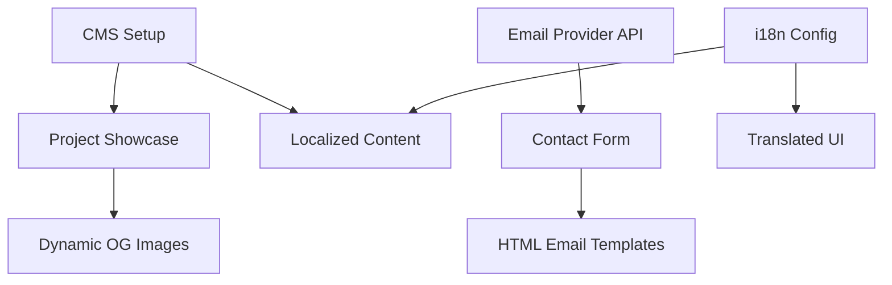

# Feature Landscape

**Domain:** Portfolio Website (Backend & Security)
**Researched:** 2026-02-07

## Table Stakes

Features users expect. Missing = product feels incomplete.

| Feature | Why Expected | Complexity | Notes |
|---------|--------------|------------|-------|
| **Contact Form** | Users expect a direct way to reach out without opening an email client. | Low | Use Server Actions + Zod validation. Integration with email provider (e.g., Resend). |
| **SEO Basics** | Portfolio must appear in search results for the owner's name. | Low | Next.js Metadata API (Title, Description). `sitemap.ts` and `robots.ts`. |
| **Project Showcase (CMS)** | The core purpose of a portfolio. Needs to be easy to update. | Medium | Headless CMS (Sanity/Contentful) to manage Project content (Title, Slug, Images, Tech Stack). |
| **i18n Routing** | If offering multiple languages, URL routing (`/en`, `/id`) is standard. | Medium | `next-intl` with Middleware for locale detection and routing. |
| **Responsive Images** | Images must load fast on all devices. | Low | Next.js `<Image>` component with CMS loader. |

## Differentiators

Features that set product apart. Not expected, but valued.

| Feature | Value Proposition | Complexity | Notes |
|---------|-------------------|------------|-------|
| **Dynamic OpenGraph Images** | Social shares look professional with custom generated images per project. | Medium | Use `@vercel/og` to generate images using the project title/tech stack on the fly. |
| **Structured Data (JSON-LD)** | Helps search engines understand "Person" and "CreativeWork" context. | Low | Inject `Person` and `Portfolio` schema into the `<head>`. |
| **"Now" Page / Status** | Shows active availability (e.g., "Open to work", "Building X"). | Low | Simple CMS boolean/text field to update status globally. |
| **HTML Email Templates** | Auto-replies and notifications look branded and professional. | Medium | Use `react-email` to build templates that match the portfolio aesthetic. |
| **Localized Content (CMS)** | Projects/About content fully translated, not just UI labels. | High | Requires CMS schema to support localized fields (e.g., `description_en`, `description_id`). |

## Anti-Features

Features to explicitly NOT build. Common mistakes in this domain.

| Anti-Feature | Why Avoid | What to Do Instead |
|--------------|-----------|-------------------|
| **`mailto:` links only** | Poor UX, exposes email to scrapers, no context on contact. | Build a contact form with spam protection (Turnstile/Honeypot). |
| **Client-side i18n** | Bad for SEO, causes "flash of untranslated content" (FOUT). | Use Server Components for translation (`next-intl` / `getTranslations`). |
| **CMS Tightly Coupled to UI** | Hard to redesign later. | Use a Headless CMS (Sanity) where content is data, not HTML blobs. |
| **Heavy Analytics** | Privacy concerns, slows down the site. | Use privacy-focused, lightweight analytics (e.g., Vercel Analytics, Plausible) or none. |
| **Comment Sections** | High maintenance, spam magnet, low value for portfolios. | Encourage email or social media interaction instead. |

## Feature Dependencies

## MVP Recommendation

For the "Backend & Security" milestone, prioritize:

1.  **CMS Integration (Sanity):** Move "Projects" and "Experience" data from static JSON/TS files to Sanity. This enables easy updates.
2.  **Contact Form (Resend):** Replace the visual-only form with a working Server Action + Resend integration.
3.  **SEO Fundamentals:** Add `sitemap.ts`, `robots.ts`, and basic Metadata API titles/descriptions.
4.  **i18n Setup:** Initialize `next-intl` and translate the static UI shell (Nav, Footer, Hero).

**Defer to Post-MVP:**
*   Full content localization (migrating all project descriptions to multiple languages).
*   Dynamic OpenGraph images (can use static defaults for now).
*   Complex email templates (simple text is fine for MVP).

## Sources
*   Next.js 16 Metadata API Docs
*   `next-intl` Documentation (App Router)
*   Sanity.io Next.js Patterns
*   Resend + React Email documentation
